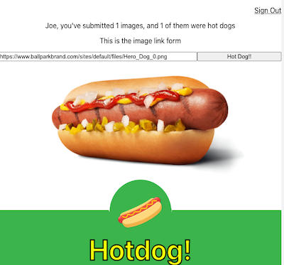
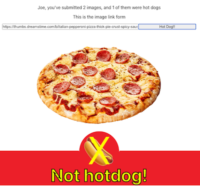

# Not Hotdog

### Contents

---

- [Background](#background)
- [Installation](#installation)
- [Technologies Used](#technologies-used)
- [Links](#links)
- [Next](#next)

### Background

This app was inspired by the HBO sitcom [Silicon Valley](https://www.hbo.com/silicon-valley) where a character's investor urged him to build "Shazam...but for food." The result was an app that was able to determine if your photo was of a hot dog. Or not a hot dog. Further background on the story and show can be found [here](https://www.engadget.com/2017-05-15-not-hotdog-app-hbo-silicon-valley.html) from Engadget (there is strong language if you watch the YouTube clips).

This React app uses the [Clarifai](https://www.clarifai.com/) Predict API with their food recognition [model](https://www.clarifai.com/models/ai-food-recognition) to create a basic identifier for hot dogs. A user will need to register and sign in to use the app (while the back end uses [bcrypt.js](https://www.npmjs.com/package/bcryptjs) to hash the password, it is not recommended to use real account information). Once signed in, a user can then submit an image URL in the input field and click on the button to see if their image contains a hot dog. The app will keep track of the number of images a registered user has submitted, as well as how many of those images were hot dogs. Demo screenshots below:

   

### Installation

1. Fork and clone back end [repository](https://github.com/cedis81/not-hot-dog-backend).
2. Install dependencies with `npm install`.
3. Run `npm start` to run website on local host 3000.
4. Fork and clone this repository.
5. Install dependencies with `npm install`.
6. Run `npm start` to run website on local host.
7. To publish on Github Pages, push your changes to Github.
8. Run `npm run build` to deploy.
9. Go on an interview with Emily Chang at Bloomberg Tech and talk about your new app [Seefood](https://twitter.com/TechAtBloomberg/status/863944535419666432?ref_src=twsrc%5Etfw%7Ctwcamp%5Etweetembed%7Ctwterm%5E863944535419666432%7Ctwgr%5E%7Ctwcon%5Es1_&ref_url=https%3A%2F%2Fwww.engadget.com%2F2017-05-15-not-hotdog-app-hbo-silicon-valley.html). (Just kidding, please don't do this).

Please note the following for the back end repo:

1. You will need to create your own database locally for development (tables shown in the [repository](https://github.com/cedis81/not-hot-dog-backend)), and eventually one host online. If you're not using PostgreSQL, you will need to change line 13 in server.js to a different client.
2. While in development, you will need to remove comments on lines 15 and 16 in server.js. You will also need to comment lines 17 through 20.
3. When you deploy (I used a free [Heroku](https://www.heroku.com/) app), you will want to revert these previous two steps - comment or delete lines 15 and 16, and lines 17-20 need to be in use. Line 17 needs to be the URL of your deployed database.
4. In image.js, you will need to use your own [Clarifai](https://www.clarifai.com/) API Key from the start, and there is a free version if you sign up.
5. In image.js, you can change the criteria for identifying a food as a hotdog. Lines 25-33 contain that logic.

### Technologies Used
- [JavaScript](https://developer.mozilla.org/en-US/docs/Web/JavaScript)
- [React](https://reactjs.org/docs/getting-started.html)
- [HTML](https://developer.mozilla.org/en-US/docs/Web/HTML)
- [CSS](https://developer.mozilla.org/en-US/docs/Web/CSS)
- [Git/Github](https://docs.github.com/en)
- [Clarifai](https://docs.clarifai.com/) API

### Links

- [Live site](https://cedis81.github.io/not-hot-dog/)
- [Back end Github repo](https://github.com/cedis81/not-hot-dog-backend)

### Next

- Providing user feedback on each action's success or failure.
- ~~Clearing form on submit and preventing multiple submits.~~
- Unit testing.
- Allow a user to change a password.
